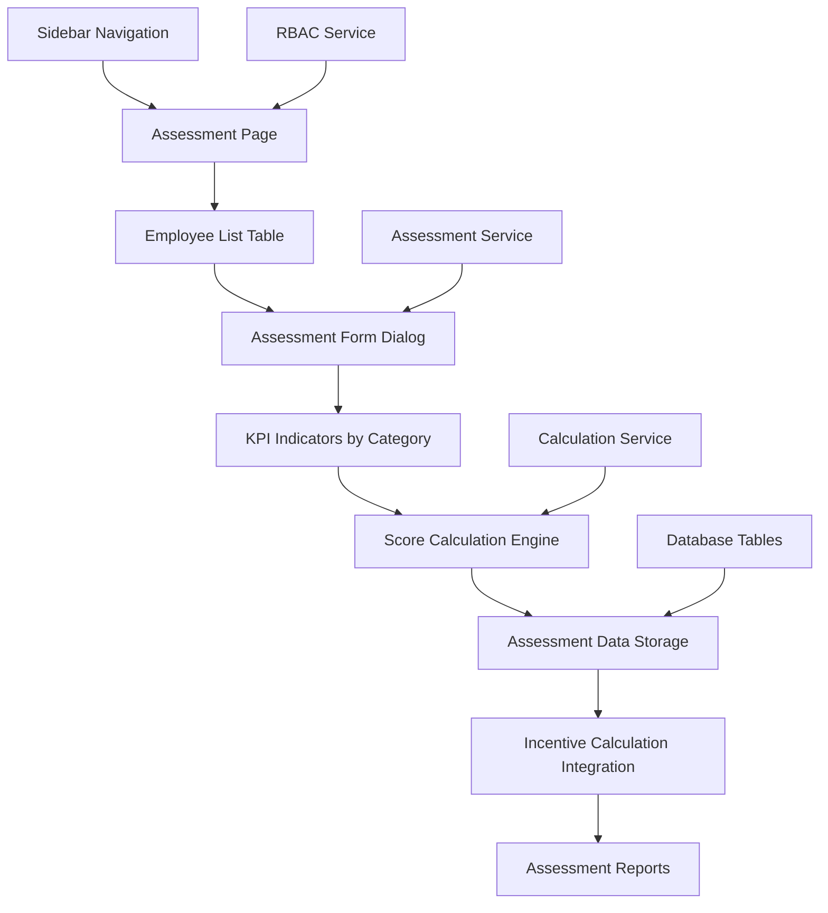

# Design Document

## Overview

The KPI Assessment System is a comprehensive feature that enables unit managers and superadmins to evaluate employee performance based on configured KPI indicators. The system integrates with the existing pool management and calculation engine to generate accurate incentive calculations based on performance assessments.

The system follows the existing JASPEL architecture patterns using Next.js 15 with App Router, Supabase for data persistence, and maintains strict Row Level Security (RLS) for data isolation between units.

## Architecture

### High-Level Architecture



### Data Flow

1. **Authentication & Authorization**: User role determines access level (unit-specific for managers, global for superadmin)
2. **Employee Selection**: System loads employees based on user permissions and selected period
3. **KPI Loading**: System retrieves KPI structure for employee's unit
4. **Assessment Input**: User inputs realization values and notes for each indicator
5. **Score Calculation**: System calculates achievement percentages and scores automatically
6. **Data Persistence**: Assessment data is saved to database with audit trail
7. **Incentive Integration**: Assessment scores feed into existing calculation engine

## Components and Interfaces

### 1. Navigation Integration

**File**: `components/navigation/Sidebar.tsx`
- Add "Penilaian KPI" menu item with ClipboardCheck icon
- Position between "Input Realisasi" and "Laporan"
- Show only for unit_manager and superadmin roles

**File**: `lib/services/rbac.service.ts`
- Add new permission: `assessment:read`, `assessment:create`, `assessment:update`
- Add route permission for `/assessment` path
- Update menu items array with assessment menu

### 2. Assessment Page

**File**: `app/(authenticated)/assessment/page.tsx`
- Server Component that handles initial data loading
- Period selector for assessment period (YYYY-MM format)
- Employee list table with assessment status
- Integration with existing authentication middleware

### 3. Assessment Table Component

**File**: `components/assessment/AssessmentTable.tsx`
- Display employees with columns: Name, Unit, Period, Status, Actions
- Status indicators: "Belum Dinilai" (red), "Sebagian" (yellow), "Selesai" (green)
- "Nilai" button to open assessment form
- Pagination and search functionality
- Real-time status updates

### 4. Assessment Form Dialog

**File**: `components/assessment/AssessmentFormDialog.tsx`
- Modal dialog for employee assessment
- Grouped KPI indicators by category (P1, P2, P3)
- Input fields for realization value and notes
- Real-time score calculation display
- Form validation and error handling
- Save and cancel actions

### 5. Assessment Service

**File**: `lib/services/assessment.service.ts`
- CRUD operations for assessment data
- Score calculation logic
- Data validation functions
- Integration with existing calculation service
- Audit trail management

### 6. Assessment API Routes

**File**: `app/api/assessment/route.ts`
- GET: Retrieve assessments for employee/period
- POST: Create new assessment
- PUT: Update existing assessment
- DELETE: Remove assessment (superadmin only)

**File**: `app/api/assessment/employees/route.ts`
- GET: List employees for assessment based on user role
- Query parameters: period, unit_id, status

**File**: `app/api/assessment/status/route.ts`
- GET: Get assessment status for employees
- Returns completion percentage and status

## Data Models

### New Database Table: t_kpi_assessments

```sql
CREATE TABLE t_kpi_assessments (
  id UUID PRIMARY KEY DEFAULT uuid_generate_v4(),
  employee_id UUID NOT NULL REFERENCES m_employees(id) ON DELETE CASCADE,
  indicator_id UUID NOT NULL REFERENCES m_kpi_indicators(id) ON DELETE CASCADE,
  period VARCHAR(7) NOT NULL, -- Format: YYYY-MM
  realization_value DECIMAL(15,2) NOT NULL DEFAULT 0.00,
  achievement_percentage DECIMAL(5,2) GENERATED ALWAYS AS (
    CASE 
      WHEN target_value > 0 THEN (realization_value / target_value * 100)
      ELSE 0 
    END
  ) STORED,
  score DECIMAL(10,2) GENERATED ALWAYS AS (
    CASE 
      WHEN target_value > 0 AND (realization_value / target_value * 100) >= 100 THEN 100
      WHEN target_value > 0 THEN (realization_value / target_value * 100)
      ELSE 0 
    END
  ) STORED,
  notes TEXT,
  assessor_id UUID NOT NULL REFERENCES m_employees(id),
  target_value DECIMAL(15,2) NOT NULL, -- Denormalized for calculation
  weight_percentage DECIMAL(5,2) NOT NULL, -- Denormalized for calculation
  created_at TIMESTAMPTZ DEFAULT NOW(),
  updated_at TIMESTAMPTZ DEFAULT NOW(),
  UNIQUE(employee_id, indicator_id, period)
);

-- Indexes for performance
CREATE INDEX idx_assessments_employee_period ON t_kpi_assessments(employee_id, period);
CREATE INDEX idx_assessments_period ON t_kpi_assessments(period);
CREATE INDEX idx_assessments_assessor ON t_kpi_assessments(assessor_id);

-- RLS Policies
ALTER TABLE t_kpi_assessments ENABLE ROW LEVEL SECURITY;

-- Unit managers can only assess employees in their unit
CREATE POLICY assessment_unit_manager_policy ON t_kpi_assessments
  FOR ALL USING (
    auth.jwt() ->> 'role' = 'superadmin' OR
    (
      auth.jwt() ->> 'role' = 'unit_manager' AND
      EXISTS (
        SELECT 1 FROM m_employees e1, m_employees e2
        WHERE e1.id = (auth.jwt() ->> 'sub')::uuid
        AND e2.id = employee_id
        AND e1.unit_id = e2.unit_id
      )
    )
  );
```

### Assessment Status View

```sql
CREATE VIEW v_assessment_status AS
SELECT 
  e.id as employee_id,
  e.full_name,
  e.unit_id,
  u.name as unit_name,
  period,
  COUNT(i.id) as total_indicators,
  COUNT(a.id) as assessed_indicators,
  CASE 
    WHEN COUNT(a.id) = 0 THEN 'Belum Dinilai'
    WHEN COUNT(a.id) = COUNT(i.id) THEN 'Selesai'
    ELSE 'Sebagian'
  END as status,
  ROUND((COUNT(a.id)::decimal / COUNT(i.id) * 100), 2) as completion_percentage
FROM m_employees e
JOIN m_units u ON e.unit_id = u.id
CROSS JOIN (SELECT DISTINCT period FROM t_pool WHERE status = 'approved') p
LEFT JOIN m_kpi_indicators i ON i.category_id IN (
  SELECT id FROM m_kpi_categories WHERE unit_id = e.unit_id AND is_active = true
)
LEFT JOIN t_kpi_assessments a ON a.employee_id = e.id 
  AND a.indicator_id = i.id 
  AND a.period = p.period
WHERE e.is_active = true
GROUP BY e.id, e.full_name, e.unit_id, u.name, period;
```

## Integration Points

### 1. Calculation Service Integration

The assessment system integrates with the existing calculation service by:

**File**: `services/calculation.service.ts`
- Modify `calculateIndividualScores()` to use assessment data from `t_kpi_assessments` instead of `t_realization`
- Maintain backward compatibility with existing realization data
- Priority: Assessment data > Realization data > Default scores

```typescript
// Modified calculation logic
const getScoreData = async (employeeId: string, period: string) => {
  // First try to get assessment data
  const assessments = await getAssessmentData(employeeId, period)
  if (assessments.length > 0) {
    return assessments
  }
  
  // Fallback to realization data
  const realizations = await getRealizationData(employeeId, period)
  return realizations
}
```

### 2. Menu System Integration

**File**: `lib/services/rbac.service.ts`
- Add assessment permissions to role definitions
- Add menu item configuration
- Update route permissions

```typescript
// New permissions
export type Permission = 
  | 'assessment:read'
  | 'assessment:create' 
  | 'assessment:update'
  | ... // existing permissions

// Updated role permissions
const rolePermissions: Record<Role, Permission[]> = {
  superadmin: [...existing, 'assessment:read', 'assessment:create', 'assessment:update'],
  unit_manager: [...existing, 'assessment:read', 'assessment:create', 'assessment:update'],
  employee: [...existing], // No assessment permissions
}

// New menu item
{
  id: 'assessment',
  label: 'Penilaian KPI',
  path: '/assessment',
  icon: 'ClipboardCheck',
}
```

### 3. Database Migration

**File**: `supabase/migrations/add_kpi_assessment_system.sql`
- Create `t_kpi_assessments` table
- Create assessment status view
- Add RLS policies
- Create necessary indexes
- Add audit triggers

## Error Handling

### Validation Rules

1. **Period Validation**: Must match YYYY-MM format and correspond to active pool
2. **Realization Value**: Must be non-negative numeric value
3. **Authorization**: Unit managers can only assess employees in their unit
4. **Data Integrity**: Prevent duplicate assessments for same employee-indicator-period
5. **Target Value**: Must be positive for percentage calculations

### Error Messages

```typescript
const errorMessages = {
  INVALID_PERIOD: 'Format periode tidak valid. Gunakan format YYYY-MM.',
  UNAUTHORIZED_ASSESSMENT: 'Anda tidak memiliki izin untuk menilai pegawai ini.',
  INVALID_REALIZATION: 'Nilai realisasi harus berupa angka positif.',
  DUPLICATE_ASSESSMENT: 'Penilaian untuk indikator ini sudah ada.',
  MISSING_POOL: 'Pool untuk periode ini belum tersedia.',
}
```

## Correctness Properties

*A property is a characteristic or behavior that should hold true across all valid executions of a system-essentially, a formal statement about what the system should do. Properties serve as the bridge between human-readable specifications and machine-verifiable correctness guarantees.*

### Property Reflection

After analyzing all acceptance criteria, several properties were identified as redundant or could be combined:

- Properties 1.1 and 1.2 can be combined into a single role-based menu visibility property
- Properties 4.4 and 4.5 can be combined into a comprehensive scoring property
- Properties 7.2, 7.3, and 7.4 can be combined into a single status calculation property
- Several validation properties (9.1-9.5) can be combined into comprehensive input validation properties

### Core Properties

**Property 1: Role-based menu access control**
*For any* user with role unit_manager or superadmin, the "Penilaian KPI" menu item should be visible, and for any user with role employee, the menu item should not be visible
**Validates: Requirements 1.1, 1.2**

**Property 2: Unit-based employee filtering**
*For any* unit manager, the assessment page should display only employees from their unit, and for any superadmin, all employees from all units should be displayed
**Validates: Requirements 2.1, 2.2**

**Property 3: Assessment form data completeness**
*For any* employee assessment form, all required fields (employee name, unit, period, assessment status, KPI indicators with name, target value, weight percentage, measurement unit) should be present in the display
**Validates: Requirements 2.3, 3.4**

**Property 4: KPI indicator grouping consistency**
*For any* set of KPI indicators loaded for an employee's unit, they should be correctly grouped by their category (P1, P2, P3) with all indicators in each group belonging to that category
**Validates: Requirements 3.2, 3.3**

**Property 5: Achievement percentage calculation accuracy**
*For any* realization value and positive target value, the achievement percentage should equal (realization_value / target_value) * 100
**Validates: Requirements 4.1, 4.2**

**Property 6: Score calculation rules**
*For any* achievement percentage, if the percentage is >= 100 then score should be 100, otherwise score should equal the achievement percentage
**Validates: Requirements 4.3, 4.4, 4.5**

**Property 7: Assessment data persistence completeness**
*For any* submitted assessment form, all required fields (employee_id, indicator_id, period, realization_value, achievement_percentage, score, notes, assessor_id) should be saved to the database
**Validates: Requirements 5.1, 5.2, 5.4**

**Property 8: Assessment update idempotency**
*For any* assessment with the same employee-indicator-period combination, submitting multiple times should result in updating the existing record rather than creating duplicates
**Validates: Requirements 5.3**

**Property 9: Unit-based authorization enforcement**
*For any* unit manager attempting to assess an employee, the assessment should only be allowed if the employee belongs to the same unit as the manager, except for superadmins who can assess any employee
**Validates: Requirements 5.5**

**Property 10: Assessment score integration**
*For any* incentive calculation, if assessment scores exist for an employee-period, they should be used; otherwise, default scores of 0 should be used
**Validates: Requirements 6.1, 6.2**

**Property 11: Score aggregation and weighting accuracy**
*For any* set of assessment scores within categories (P1, P2, P3), the aggregated scores should be correctly calculated using category weight percentages, and final incentive calculations should include gross incentive, tax amount, and net incentive
**Validates: Requirements 6.3, 6.4, 6.5**

**Property 12: Assessment status calculation accuracy**
*For any* employee in a given period, if all KPI indicators are assessed the status should be "Selesai", if some are assessed the status should be "Sebagian", if none are assessed the status should be "Belum Dinilai"
**Validates: Requirements 7.1, 7.2, 7.3, 7.4**

**Property 13: Status color coding consistency**
*For any* assessment status, "Selesai" should display green, "Sebagian" should display yellow, and "Belum Dinilai" should display red color coding
**Validates: Requirements 7.5**

**Property 14: Audit trail completeness**
*For any* assessment creation or modification, timestamp, assessor information, and change history should be recorded and maintained
**Validates: Requirements 8.1, 8.2, 8.3, 8.5**

**Property 15: Authorization enforcement for modifications**
*For any* attempt to modify an assessment, only authorized users (the original assessor, unit managers for their unit employees, or superadmins) should be allowed to make changes
**Validates: Requirements 8.4**

**Property 16: Input validation comprehensiveness**
*For any* assessment form input, realization values should be validated as numeric and non-negative, required fields should prevent submission when empty, periods should match YYYY-MM format and correspond to active pools, and extreme values should trigger warnings
**Validates: Requirements 9.1, 9.2, 9.3, 9.4, 9.5**

**Property 17: Assessment report accuracy**
*For any* assessment report generation, completion rates should be accurately calculated, scores should be correctly displayed by category and employee, and unit-level averages should be properly aggregated
**Validates: Requirements 10.1, 10.2, 10.4**

**Property 18: Report export format consistency**
*For any* report export, the Excel format should contain detailed breakdown with all assessment data properly formatted and organized
**Validates: Requirements 10.3**

**Property 19: Period comparison accuracy**
*For any* trend analysis between periods, comparisons should accurately reflect changes in assessment scores and completion rates over time
**Validates: Requirements 10.5**

## Testing Strategy

### Unit Tests

1. **Assessment Service Tests**
   - CRUD operations validation
   - Score calculation accuracy
   - Authorization checks
   - Data validation

2. **Component Tests**
   - Form validation behavior
   - Score calculation display
   - Status indicator accuracy
   - User interaction flows

3. **API Route Tests**
   - Authentication and authorization
   - Data validation
   - Error handling
   - Response formats

### Property-Based Tests

Each correctness property must be implemented as a property-based test with minimum 100 iterations. Tests should be tagged with the format: **Feature: kpi-assessment-system, Property {number}: {property_text}**

### Integration Tests

1. **End-to-End Assessment Flow**
   - Complete assessment process from menu to save
   - Score calculation integration
   - Incentive calculation impact

2. **Role-Based Access Testing**
   - Unit manager restrictions
   - Superadmin full access
   - Employee access denial

3. **Database Integration**
   - RLS policy enforcement
   - Data consistency
   - Audit trail creation